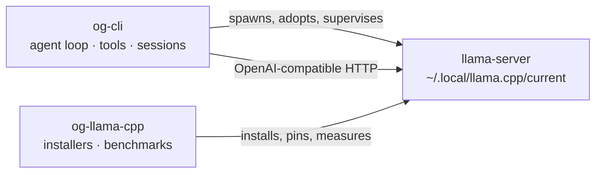

# og-ai

A local-first coding agent and the GPU inference engine it runs on, kept as two projects in one
repository because they are two concerns. Inference, code and conversation history never leave
the machine.

```
og-ai/
  README.md       this file
  AGENTS.md       the single agent-facing context file for both projects
  og-cli/         the coding CLI — agent loop, tools, sessions, TUI + headless
  og-llama-cpp/   the inference engine — pinned llama.cpp CUDA build, installers, benchmarks
```

| Project | What it gives you | Start at |
| --- | --- | --- |
| [`og-cli/`](og-cli/) | `og` on your `PATH`: an agent loop, seven sandboxed tools, a SQLite session store, and two front-ends | [`og-cli/README.md`](og-cli/README.md) |
| [`og-llama-cpp/`](og-llama-cpp/) | `llama-server` in `~/.local/llama.cpp/current`, built or unzipped from one pinned llama.cpp tag | [`og-llama-cpp/README.md`](og-llama-cpp/README.md) |

## Why two projects



The boundary is HTTP and nothing else. `og` supervises whatever OpenAI-compatible server its
`endpoint` names — a local `llama-server`, a remote box, anything — and the engine repository
produces such a server without knowing `og` exists. Neither tree imports from the other, and
either is useful alone: point `og` at a hosted endpoint and you never need `og-llama-cpp`; use
the installers to get a tuned `llama-server` and drive it with anything you like.

One git repository, [`hjawhar/og-ai`](https://github.com/hjawhar/og-ai), holding two projects.
There is no workspace-level build, lockfile or package — every command runs inside one
subdirectory or the other, and neither project's source ever reaches across the boundary.

## The problem this exists to solve

The hosted-UI runner previously used on the reference machine (LM Studio) mis-sized a 30B MoE
model for a 16 GiB card. It loaded, it answered, and it did so about **eight times slower than
the hardware allows**: once resident VRAM crosses roughly 15.4 GiB the NVIDIA driver silently
pages weights back into host RAM over PCIe. Nothing in that stack surfaced the spill — no error,
no warning, just a model that felt sluggish.

So VRAM is treated as the binding constraint of the whole system. Every model profile is a
*measured* operating point sized to leave headroom, `og engine status` reports free VRAM, the
pinned status row shows it during a run, and the CLI warns before starting when the GPU is
already too full to be fast. The measurements that back every one of those numbers live in
[`og-llama-cpp/docs/benchmarks.md`](og-llama-cpp/docs/benchmarks.md), along with the spill-cliff
analysis.

## Quickstart

Reference box: RTX 5070 Ti (16303 MiB), Ubuntu 26.04, CUDA 13.3, llama.cpp b10488.

```sh
git clone https://github.com/hjawhar/og-ai && cd og-ai

# 1. engine — compiles the pinned tag on Linux, unzips the upstream CUDA release on Windows
cd og-llama-cpp && ./install-engine.sh
~/.local/llama.cpp/current/llama-server --list-devices   # must name a CUDA device

# 2. weights — one GGUF in ~/models for the default profile
mkdir -p ~/models && cd ~/models
curl -SfL --retry 5 -C - -O \
  https://huggingface.co/unsloth/Qwen3-Coder-30B-A3B-Instruct-GGUF/resolve/main/Qwen3-Coder-30B-A3B-Instruct-UD-Q4_K_XL.gguf

# 3. cli — built from source, then copied onto PATH
cd ../og-cli && bun install && bun run build
install -m755 dist/og ~/.local/bin/og

# 4. first run
og models          # are the weights where og expects them?
og engine start    # idempotent: adopts a healthy server, else spawns one
og                 # interactive TUI
```

Bun >= 1.3 is a **build-time** requirement only: `bun build --compile` emits a self-contained
`dist/og` that embeds its runtime. Nothing is published to a registry — no npm package, no
release pipeline, no CI. Each repository's README documents the full path, including the Windows
recipes and the rootless CUDA toolkit setup.

## Where things are documented

| Question | Document |
| --- | --- |
| How do I install and use `og`? | [`og-cli/README.md`](og-cli/README.md) |
| It is running badly / it will not start | [`og-cli/docs/runbook.md`](og-cli/docs/runbook.md) |
| How do I get `llama-server` on this box? | [`og-llama-cpp/README.md`](og-llama-cpp/README.md) |
| How fast is it, and why is that the default profile? | [`og-llama-cpp/docs/benchmarks.md`](og-llama-cpp/docs/benchmarks.md) |
| A new llama.cpp build is out | [`og-llama-cpp/docs/upgrading.md`](og-llama-cpp/docs/upgrading.md) |
| I need a patched or differently-configured build | [`og-llama-cpp/docs/building-by-hand.md`](og-llama-cpp/docs/building-by-hand.md) |
| I am an agent working in this tree | [`AGENTS.md`](AGENTS.md) — the only one, covering both repositories |

## License

MIT, both repositories — see [`og-cli/LICENSE`](og-cli/LICENSE) and
[`og-llama-cpp/LICENSE`](og-llama-cpp/LICENSE). The pinned llama.cpp is MIT too, but it is built
separately and never vendored into either tree.
