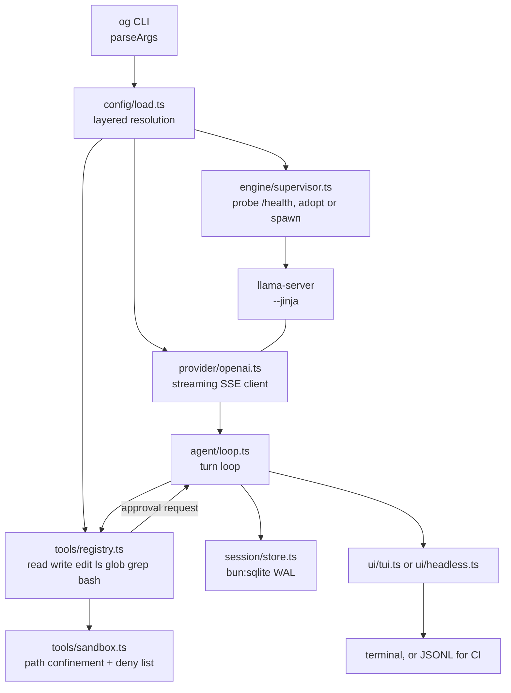

# og

`og` is a local-first agentic coding CLI: an agent loop, a tool suite, a session store and
two front-ends (TUI and headless) wrapped around an OpenAI-compatible inference endpoint that
is normally a `llama-server` process `og` supervises itself. It exists because the hosted-UI
runner previously in use on the reference machine (LM Studio) mis-sized a 30B MoE model for a 16 GiB
card: it loaded, it answered, and it did so about eight times slower than the hardware allows,
because once resident VRAM crosses roughly 15.4 GiB the NVIDIA driver silently pages weights
back into host RAM. Nothing in that stack surfaced the spill. `og` therefore treats VRAM as
the binding constraint of the whole system — every model profile is a *measured* operating
point sized to leave headroom, `og engine status` reports free VRAM, and the CLI warns before
a run when the GPU is too full to be fast. Inference, code, and conversation history never
leave the machine.

---

## Requirements

| Component | Requirement |
| --- | --- |
| OS | Ubuntu 26.04 LTS (kernel 7.0), the current reference box, and Windows 11 Pro build 26200, where the profile numbers below were measured. Both are first-class, maintained install paths; macOS installs from the same npm package and is unmeasured |
| GPU | NVIDIA, >= 16 GiB VRAM. Tuned on an RTX 5070 Ti (16303 MiB, Blackwell, compute capability 12.0 / `sm_120`) with the CUDA 13.3 toolkit; driver 595.84 under Ubuntu, 610.88 on the Windows install |
| CPU / RAM | Ryzen 7 9800X3D + 64 GiB on the reference box; any modern 8-core is fine |
| Runtime | Node + npm, to install and launch (`og` on PATH is a Node launcher in front of a self-contained binary; nothing is compiled). Bun >= 1.3 only to develop from a checkout — there are zero npm runtime dependencies |
| Engine | llama.cpp CUDA build — b10488 (`9d77fa172`) is the pinned, measured build |
| Weights | One or more GGUF files in `~/models` (`%USERPROFILE%\models` on Windows) |

Ubuntu and Windows are both supported code paths: the engine installers under
`llama-cpp-installation/` are per-platform, and everything above them — the CLI included — is
platform-neutral. The measured operating points in this README — VRAM figures, prefill and
generation throughput, the ~15.4 GiB spill threshold — were taken on the hardware above **while
that box ran Windows 11**, with llama.cpp b10488 and CUDA 13.3, and have not been re-measured
since it moved to Ubuntu. A VRAM ceiling and kernel-level throughput are properties of the card
and the build rather than of the OS, so those numbers are still the right sizing targets on
Linux — but treat them as unverified there until someone re-runs the sweep. macOS and
non-NVIDIA GPUs are unmeasured too, and not blocked by anything in the code: paths, process kill
and `nvidia-smi` probing all degrade gracefully.

## Install

Two separable concerns, deliberately kept apart in the tree:

| Concern | Lives in | What it gives you |
| --- | --- | --- |
| The coding CLI | the [`@hjawhar/og-cli`](https://www.npmjs.com/package/@hjawhar/og-cli) npm package | `og` itself: the agent loop, tools, sessions and both front-ends |
| The inference engine | [`llama-cpp-installation/`](llama-cpp-installation/) | a pinned llama.cpp CUDA `llama-server` in `~/.local/llama.cpp/current` — nothing in it knows about `og` |

### 1. `og`

```sh
npm i -g @hjawhar/og-cli     # puts `og` on PATH
npx @hjawhar/og-cli models   # or run it once, without installing
```

One command, identical on Ubuntu, macOS and Windows. The package ships a **prebuilt,
self-contained binary per platform** — `linux-x64`, `linux-arm64`, `darwin-x64`, `darwin-arm64`,
`win32-x64` — as five `optionalDependencies` gated on `os`/`cpu`, so npm fetches exactly the one
your machine can run and nothing is compiled at install time. **Bun is not required to run `og`**,
only to develop it: the `og` on your PATH is a small Node launcher that resolves the platform
package and `exec`s the binary inside it. Pin or upgrade the usual way —
`npm i -g @hjawhar/og-cli@<version>`.

### 2. Engine

```sh
llama-cpp-installation/install-engine.sh                                        # Linux
powershell -ExecutionPolicy Bypass -File llama-cpp-installation\install-engine.ps1   # Windows
```

Linux compiles the pinned tag (upstream publishes a CUDA release asset for Windows and for no
other platform), Windows unzips it. Both end at the same shape: a flat `engine.binDir` with
`llama-server` beside its shared libraries and a `current` symlink/junction pointing at the build
in use, so `engine.binDir` never changes when you bump builds. Prerequisites (CMake, a CUDA >= 12.8
toolkit, the rootless toolkit recipe), the env knobs and the upgrade/rollback drill are documented
in [`llama-cpp-installation/README.md`](llama-cpp-installation/README.md).

The two installers are the only thing an npm-installed `og` ever needs from the repository, and a
single file each — fetch one directly if you have no checkout:
`curl -sSfLO https://raw.githubusercontent.com/hjawhar/og-cli/main/llama-cpp-installation/install-engine.sh`.

Any OpenAI-compatible endpoint works instead: point `endpoint` at it and set
`engine.autoStart: false`. The engine install is only needed for the supervised-local-server case.

macOS is an install target for the CLI, not a measured one, and there is no CUDA there: a Metal or
CPU llama.cpp build serves `og` perfectly well, but every shipped profile is sized for a 16 GiB
CUDA card and the `nvidia-smi`-derived VRAM reporting is simply absent.

### 3. First run

```sh
og models             # do the weights og expects exist?
og engine start       # bring the server up
```

`models` prints the profile table with each GGUF's on-disk state, so a typo in a filename is
caught before anything touches the GPU. `engine start` is idempotent: a healthy server at the
configured endpoint is adopted, never duplicated.

### From a checkout

For developing `og` itself — this is the only path that needs Bun:

```sh
git clone https://github.com/hjawhar/og-cli && cd og-cli
bun install                             # dev dependencies: typescript + @types/bun, nothing else
bun run src/index.ts models             # run straight from source
bun run src/index.ts engine start
bun run build                           # -> dist/og, one self-contained executable (dist/og.exe on Windows)
bun run tools/release.ts                # cross-compile all five targets into the publishable packages under dist/npm/
```

`tools/release.ts` publishes only when passed `--publish`; without it you get the assembled
package tree to inspect.

Everything below is written as `og ...`; from a source checkout the equivalent is
`bun run src/index.ts ...`.

## Usage

```sh
og                                      # interactive TUI
og "add a peek() method to src/lru.ts"  # one-shot in the TUI renderer
og -p "fix the failing test in src/fizz.ts"    # headless: answer on stdout, diagnostics on stderr
git diff | og -p "review this"          # piped stdin becomes the prompt
og --json -p "reply with the single word ready"  # JSONL events for CI
og -c -p "now add tests for it"         # continue the latest session for this directory
og -r 7d8ba2ec-635d-4f9e-bd1e-ca0ebe7fd9fd     # resume a specific session
og -m qwen3-coder-30b-fast -p "explain src/agent/loop.ts"
og --endpoint http://gpubox.lan:8127 --no-autostart -p "..."
og models
og engine start                         # also: engine stop, engine status, engine status -v
og sessions list                        # also: sessions show <id>, sessions rm <id>
```

`og --help` is the authoritative flag list. Full surface:
`-p/--print`, `--json`, `-m/--model`, `-c/--continue`, `-r/--resume`, `--cwd`, `--endpoint`,
`--no-autostart`, `--max-steps`, `-v/--verbose`, `--version`, `-h/--help`.

Inside the TUI: `/help`, `/models [list|switch <key>|info <key>]`, `/usage`, `/stats`,
`/engine`, `/context`, `/clear`, `/sessions`, `/resume <id>`, `/cost`, `/exit`. `Ctrl+C` aborts
a run in flight, twice quits; `Ctrl+D` quits. `Tab` completes commands, model keys and paths.

### The pinned status row

The top line of the terminal is **reserved**, not reprinted. `og` installs a DECSTBM scroll
region covering rows 2..N, so the transcript scrolls underneath a row that never moves. There
is exactly one place on screen where context occupancy lives.

Idle:

```
● qwen3-coder-30b · ~/demo-ace · ctx █░░░░░░░░░ 3% 942/32.8k · 5.2k tok · 761 MiB free ── read rate-limit.ts and …
❯ what next
```

Running:

```
⠹ qwen3-coder-30b · reading context · 1.1s · – tok/s · ctx █░░░░░░░░░ 3% 999/32.8k
⠋ qwen3-coder-30b · generating · 1.3s · 82.1 tok/s · ttft 1.2s · ctx █░░░░░░░░░ 3% 1.0k/32.8k
⠼ qwen3-coder-30b · bash 1.2s · 3.4s · 81.0 tok/s · ttft 380ms · ctx █░░░░░░░░░ 4% 1.3k/32.8k
```

| Field | Meaning |
| --- | --- |
| `●` / `○` (idle) | engine reachable at `endpoint`, or not |
| spinner (running) | the run is alive; it disappears the moment the run settles |
| model | active profile key (`/models switch` changes it) |
| phase | `reading context` while the server prefills, `generating` while tokens stream, or `<tool> <elapsed>` while a tool runs (`+N` when several run in parallel) |
| elapsed | wall clock for the request |
| tok/s | **decode-only** throughput; prefill and tool waits are excluded, and samples under 250 ms are withheld instead of reported as a spike |
| ttft | time to first token for this run, once it arrives |
| `ctx` gauge | bar, percentage and absolute `used/window` tokens. Green under 60%, yellow from 60%, red from 85%; compaction fires at `agent.compactThresholdPct` (default 75%) |
| path / tokens / VRAM (idle) | cwd (elided from the left), cumulative session tokens, free VRAM (red under 700 MiB — the measured spill threshold) |
| right-aligned text (idle) | session title, from the first prompt |

The row reflows on resize, gives itself back if the terminal shrinks below six rows, emits
nothing when stdout is not a TTY, and releases the scroll region on every exit path including
`uncaughtException` — a process that dies with a region installed would leave your shell
scrolling inside a sub-window. Set `OG_ASCII=1` to draw gauges with `=`/`.`.

Run summaries stay in the transcript and deliberately carry no context gauge, so occupancy is
never shown in two places:

```
2 steps · 1.5s · 82.1 tok/s gen · ttft 1.2s
```

### `/usage` — occupancy, throughput and TTFT

```
model qwen3-coder-30b
  Qwen3-Coder-30B-A3B-Instruct-UD-Q4_K_XL.gguf · ctx 32.8k · ngl 99 · n-cpu-moe 14 · kv q8_0/q8_0
context
  ctx █░░░░░░░░░ 5% 1.5k/32.8k
  reserve 25% · compaction at 75% (24.6k) · 31.3k free
this session
  1 run · 5116↑ 42↓ = 5.2k tok
  stored total 5.2k tok across 5 messages
last run
  2 steps · 1.5s wall · decode 42 tok in 180ms (sample too short to rate) · ttft 1.2s
across 1 run on this model
  decode 82.1 tok/s over 1.4k generated tokens
  ttft over 1 turn: median 726ms · mean 726ms · min 726ms · max 726ms
  ttft includes prefill of the whole transcript, so it grows with context
```

TTFT is measured per model turn, so a multi-step run contributes one sample per turn. Metrics
are filtered to the active profile: switching models does not mix two models' throughput.

### `/stats` — machine and engine

```
host
  os         linux 7.0.0-30-generic (x64)
  hostname   tracecall-pc
  uptime     57m40s

cpu
  model      AMD Ryzen 7 9800X3D 8-Core Processor
  cores      8 physical · 16 logical
  clock      5200 MHz

memory
  installed  59.5 GiB
  in use     ██░░░░░░░░ 17% 9.8 GiB
  free       49.7 GiB

gpu
  gpu 0      NVIDIA GeForce RTX 5070 Ti
    vram     █████████░ 94% 15339 / 16303 MiB
    device   driver 595.84 · compute 12.0
    load     3% util · 47°C

runtime
  bun        1.3.14
  node api   24.3.0

engine
  bin dir    /home/tracecall/.local/llama.cpp/current
  build      b10488
  server     version: 0.1.2-dev (build 1, commit 9d77fa1)
  endpoint   http://127.0.0.1:8127 reachable
  models dir /home/tracecall/models
  weights    1 file
    16.5 GiB Qwen3-Coder-30B-A3B-Instruct-UD-Q4_K_XL.gguf
```

On Windows the same fields render with `win32` values — `win32 10.0.26200 (x64)` on the `os` line
and `%USERPROFILE%`-rooted `bin dir` and `models dir` paths.

Every probe is best-effort: no NVIDIA GPU, no `nvidia-smi`, or an absent engine directory each
degrade to a stated absence rather than an error.

### Switching models

```sh
og models                    # list profiles with size and availability
og models use <key>          # persist the default to ~/.og/config.json

/models list                 # inside the TUI, with offload split and sampling
/models switch <key>         # change model for this session
/models info <key>           # everything configured for one profile
```

Switching to a profile whose weights differ from what the engine has loaded prints a warning;
the engine restarts on the next prompt, or immediately with `og engine stop`.

### Shell completion

**Bash:**

```sh
# current session
eval "$(og completion bash)"

# permanently
og completion bash > ~/.og-completion.bash
echo 'source ~/.og-completion.bash' >> ~/.bashrc
```

**PowerShell** — the same vocabulary, on a Windows install:

```powershell
og completion powershell | Out-String | Invoke-Expression   # this session
og completion powershell | Out-File -Append $PROFILE        # permanently
```

Completes subcommands (`engine`, `sessions`, `models`, `completion`), their actions, and all
flags. The vocabulary is static — nothing runs `og` at completion time. Known PowerShell 5.1
limitation: its parser never invokes native completers while you are mid-typing a `-flag`
word, so flags complete after a positional word but not from a bare `-`; bash has no such gap.

Headless mode reports usage per turn on stderr:
`tokens 2264↑ 2↓ · context 3% (962/32.8k)`.

### Exit codes

| Code | Meaning |
| --- | --- |
| `0` | success |
| `1` | error: bad config, unreachable/failing provider, engine could not start, unknown session, or the run ended with a fatal agent error |
| `2` | step cap reached (`agent.maxSteps`, or `--max-steps`) |
| `130` | aborted (`Ctrl+C` / SIGINT) |

Precedence when several apply: a real failure outranks an interrupt, which outranks the step cap.

### `--json` for CI

`--json` implies `-p`, sends one JSON object per line to stdout, and ends with exactly one
`result` line — so a CI step can stream progress and still parse a single summary:

```console
$ og --json -p "reply with the single word ready" --max-steps 1
{"type":"turn-start","step":1}
{"type":"text","delta":"ready"}
{"type":"usage","promptTokens":2178,"completionTokens":2,"contextUsedPct":2.5848388671875}
{"type":"done","steps":1,"stopReason":"stop"}
{"type":"result","text":"ready","steps":1,"stopReason":"stop","promptTokens":2178,"completionTokens":2,"sessionId":"d5a1d59d-c6fc-41e2-b0c5-7db7dd9e2033"}
```

Event types: `turn-start`, `text`, `reasoning`, `tool-start`, `tool-end`, `approval`, `usage`,
`compaction`, `error`, `done`, then `result`. `contextUsedPct` is a **percentage** (0-100), not
a fraction. The `approval` event is emitted without its `resolve` closure.

## Configuration

### Layering

Later layers win; objects merge recursively, arrays and scalars replace wholesale:

```
DEFAULT_CONFIG  ->  ~/.og/config.json  ->  <workspace>/.og/config.json  ->  OG_* env  ->  CLI flags
```

`<workspace>` is the nearest ancestor of the working directory containing `.git`, else the
working directory itself. Use `~/.og/config.json` for machine facts (where your weights and
llama.cpp live, which profile you prefer) and `<workspace>/.og/config.json` for per-repo
policy (approval rules, step caps, a repo-specific model). An invalid field fails fast with a
`ConfigError` naming the field — malformed JSON never silently degrades to defaults.

### Environment variables

| Variable | Effect |
| --- | --- |
| `OG_ENDPOINT` | override `endpoint` |
| `OG_MODEL` | override the active profile key |
| `OG_API_KEY` | bearer token for the OpenAI-compatible endpoint |
| `OG_STATE_DIR` | override `~/.og` |
| `OG_NO_AUTOSTART` | any value except `0`/`false`/`no`/`off`/empty sets `engine.autoStart = false` |

### Profile fields

| Field | Meaning |
| --- | --- |
| `file` | GGUF filename relative to `engine.modelsDir`, or an absolute path |
| `ctx` | KV cache length handed to `llama-server` (`-c`) |
| `nGpuLayers` | layers offloaded to the GPU (`-ngl`); `99` = all |
| `nCpuMoe` | MoE expert layers kept on the CPU (`--n-cpu-moe`); omit for dense models. This is the primary VRAM dial for MoE weights |
| `cacheTypeK` / `cacheTypeV` | KV cache quantisation, `f16` \| `q8_0` \| `q4_0`. `q8_0`/`q8_0` halves KV footprint versus `f16` at no measurable quality cost here |
| `flashAttn` | `--flash-attn on/off`; on for every measured profile |
| `contextWindow` | logical window the agent budgets tokens against; must be `<= ctx` |
| `temperature`, `topP`, `topK`, `minP`, `repeatPenalty` | sampling; the Qwen3-Coder profiles use the author-recommended `0.7 / 0.8 / 20 / 0 / 1.05` |
| `extraArgs` | raw extra `llama-server` flags appended verbatim |

### Engine, agent and tool fields

`engine`: `autoStart`, `binDir` (default `~/.local/llama.cpp/current`), `modelsDir` (default
`~/models`), `host`, `port` (default `8127`), `threads` (default half the logical cores),
`batchSize` (`-b`, 2048), `ubatchSize` (`-ub`, 512), `slots` (`--parallel`, 1),
`startupTimeoutSec` (240 — a 16 GiB model load off a cold cache is slow).

`agent`: `maxSteps` (60), `temperature`, `maxTokens` (8192), `contextReservePct` (0.25 of the
window held back for the next response plus tool results), `compactThresholdPct` (0.75 — compact
once used tokens exceed this fraction of the window), `maxParallelTools` (4).

`tools`: `bash.enabled`, `bash.approval`, `bash.timeoutMs` (120 000), `bash.denyPatterns`,
`edit.approval`, `denyPaths`, `maxOutputBytes` (65 536 bytes returned to the model per call).

### Approval policies

Three values, and which requests each gates:

| Policy | Behaviour without a human (headless) | Behaviour in the TUI |
| --- | --- | --- |
| `never` | auto-approve | auto-approve, no prompt |
| `unsafe-only` | approve everything except `exec`-risk requests | prompt only for `exec`-risk requests |
| `always` | refuse — there is nobody to ask | prompt for every gated request |

Routing is fixed: **read-only** requests (`read`, `ls`, `glob`, `grep`) are never gated;
`bash` and any `exec`-risk request is governed by `tools.bash.approval`; every other mutating
request (`write`, `edit`) is governed by `tools.edit.approval`. `bash.denyPatterns` are
absolute — a matching command is refused regardless of policy, and no approval can override it.

Defaults are `bash: "unsafe-only"`, `edit: "never"`.

### Worked example: auto-approve edits, prompt for shell

`<repo>/.og/config.json`:

```json
{
  "model": "qwen3-coder-30b",
  "agent": { "maxSteps": 40 },
  "tools": {
    "edit": { "approval": "never" },
    "bash": { "approval": "always", "timeoutMs": 300000 },
    "denyPaths": [
      "**/.git/objects/**",
      "**/node_modules/**",
      "**/.env",
      "**/.env.*",
      "**/*.pem",
      "**/*.key",
      "**/id_rsa*",
      "**/.ssh/**",
      "**/.og/sessions.db*",
      "infra/terraform/**"
    ]
  }
}
```

The agent rewrites source freely (git is the undo button) but every command — including
`bun test` — waits for a keypress. Note that `denyPaths` is an **array**, so this replaces the
default list rather than extending it; the defaults are repeated above before the new entry.
In headless CI this config would deny all `bash` calls, so CI should ship its own overlay with
`"bash": { "approval": "unsafe-only" }`.

## Model profiles

Measured on the hardware above, under Windows 11 with llama.cpp b10488 (see the provenance note
under Requirements), with a 6k-token prefill and a 256-token generation, `q8_0` KV, flash
attention on, VRAM sampled with `nvidia-smi` while loaded. Idle desktop use was 968 MiB of the
16303 MiB card; the working budget is therefore ~15200 MiB.

| Profile | Weights | ctx | `--n-cpu-moe` | VRAM (MiB) | Prefill (tok/s) | Generation (tok/s) | Pick when |
| --- | --- | --- | --- | --- | --- | --- | --- |
| `qwen3-coder-30b` *(default)* | `Qwen3-Coder-30B-A3B-Instruct-UD-Q4_K_XL.gguf` (16.45 GiB) | 32768 | 14 | 14714 | 1476 | 82.1 | Default. Best quality-per-token that still leaves ~1.6 GiB of headroom |
| `qwen3-coder-30b-long` | same Q4_K_XL | 65536 | 18 | 15082 | 1238 | 69.5 | Large refactors and long transcripts; costs ~15% throughput for 2x context |
| `qwen3-coder-30b-fast` | `Qwen3-Coder-30B-A3B-Instruct-UD-Q3_K_XL.gguf` (12.86 GiB) | 32768 | 4 | 14569 | 2957 | 136.5 | Iteration speed over precision: ~1.7x generation, 2x prefill, at Q3 quality |
| `devstral-24b` | `Devstral-Small-2507-Q4_K_M.gguf` (13.35 GiB) | 8192 | — (`-ngl 99`) | 15045 | 2292 | 51.3 | Second opinion from a dense model. 8k window is the hard ceiling on 16 GiB |

Dense 24B at Q4 leaves room for only 8k of KV once fully offloaded; buying 32k by partial
offload measured 14.1 tok/s generation, a 3.6x loss, so full offload with a short window is
the only sane operating point for `devstral-24b`.

Spot-check after the box moved to Ubuntu 26.04 (CUDA 13.3 toolkit, driver 595.84, same b10488
source tag compiled locally): `llama-bench -ngl 99 -ncmoe 14 -ctk q8_0 -ctv q8_0 -fa 1 -p 6144
-n 256 -r 1` on the default profile reports **1611 tok/s prefill and 102 tok/s generation**, and
`og engine status -v` reports 15170 MiB of the card in use with the profile loaded. Linux is
therefore no slower than the Windows numbers above on the default profile; the other three rows
have not been re-run, which is why the table is still labelled as the Windows sweep.

Full sweep, spill analysis and the end-to-end agent runs: [`docs/benchmarks.md`](docs/benchmarks.md).
Operations, failure modes and the spill fix ladder: [`docs/runbook.md`](docs/runbook.md).

## Architecture

| Module | Responsibility |
| --- | --- |
| `src/config/` | Layered config resolution and validation; owns `DEFAULT_CONFIG` and the measured profiles |
| `src/provider/` | OpenAI-compatible streaming client: SSE parsing, indexed tool-call accumulation, `/tokenize`, health probing, retry classification |
| `src/engine/` | Deterministic `llama-server` argv construction plus the supervisor that starts, adopts, reports and stops it |
| `src/tools/` | The seven tools (`read`, `write`, `edit`, `ls`, `glob`, `grep`, `bash`) and the sandbox that confines them |
| `src/agent/` | The turn loop, system prompt, token accounting and history compaction |
| `src/session/` | `bun:sqlite` (WAL) persistence of sessions, messages and usage |
| `src/ui/` | Pure formatters plus the two surfaces: interactive TUI and headless/JSONL |



### Two invariants that keep local models working

1. **`llama-server` runs with `--jinja`.** The model's own chat template is applied
   server-side, so tool calls arrive as native OpenAI-style `tool_calls` instead of prose that
   has to be scraped. Drop `--jinja` and tool calling degrades to hallucinated XML.
2. **Compaction never separates an assistant tool-call message from its tool replies.**
   History is split into turns (a user message plus every assistant/tool message following it)
   and only whole turns are dropped, oldest first; the newest turn is never dropped. An
   orphaned `role: "tool"` message makes the jinja template fail outright, which looks like a
   provider bug and is not one.

## Remote / shared inference server

`endpoint` is always explicit — there is no baked-in localhost assumption — so the same build
is both host and client:

```sh
# on the GPU box: bind to the LAN and give each client its own slot
og engine status -v      # prints the exact argv og would use; adapt it
# ...add --host 0.0.0.0 and raise --parallel via engine.host / engine.slots

# on a client
og --endpoint http://gpubox.lan:8127 --no-autostart -p "review this diff"
```

`--no-autostart` (or `OG_NO_AUTOSTART=1`, or `engine.autoStart: false`) is the correct client
setting: without it a client whose network path is down will try to spawn a local
`llama-server` that it has no weights for. With it, an unreachable endpoint fails immediately
and prints the exact command line the server should be running.

Raise `engine.slots` (`--parallel`) to the number of concurrent clients and give each slot its
share of `ctx`: `llama-server` divides the KV cache across slots, so `-c 32768 --parallel 4`
gives each client an 8k window. Size `contextWindow` to that per-slot figure, not to `ctx`.
`--cont-batching` is always on, so slots interleave rather than queue.

## Security posture

- **Workspace confinement.** Every model-supplied path is resolved against the workspace root
  with symlinks followed as far as the filesystem allows (walk to the nearest existing
  ancestor, `realpath` it, re-append the tail), so a `link -> /etc` escape is caught. Anything
  outside the root raises `SandboxError`.
- **Deny-listed paths.** `tools.denyPaths` globs are matched against both the absolute and the
  workspace-relative form. Defaults cover `.git/objects`, `node_modules`, `.env*`, `*.pem`,
  `*.key`, `id_rsa*`, `.ssh/**` and `og`'s own `sessions.db` — credentials are unreadable
  even to a compliant agent.
- **Bash deny patterns.** Case-insensitive regexes over the whole command line, refused
  unconditionally and unappealably: drive/profile-root deletes, `mkfs`/`diskpart`/`dd of=`,
  shutdown and `bcdedit`, `HKLM` registry deletes, curl-pipe-to-shell and
  `iwr | iex`, fork bombs, tree-wide `chmod`/`chown`/`takeown`, and `git push --force` to
  `main`/`master`. Scope is deliberately catastrophic-only — ordinary destructive work such as
  `rm -rf build` stays under the approval gate where a human can judge it.
- **Overwrite gating.** `write` to an existing file is refused unless that file was read in
  this session, so the agent cannot blind-clobber a file it never looked at.
- **Approval gating.** See the policy table above. Headless runs never silently escalate: a
  policy that needs a human denies the call and says so on stderr.
- **Output caps.** Tool results are truncated to `tools.maxOutputBytes` on UTF-8 codepoint
  boundaries, so a runaway command cannot blow up the context or the transcript.
- **Nothing leaves the machine.** The only network call is to `endpoint`. There is no
  telemetry, no analytics, no update check, and no cloud provider in the tree.

## License

MIT — see [`LICENSE`](LICENSE). The npm packages carry the same terms; the pinned llama.cpp it
drives is MIT too, but it is built separately and never vendored into this tree.
