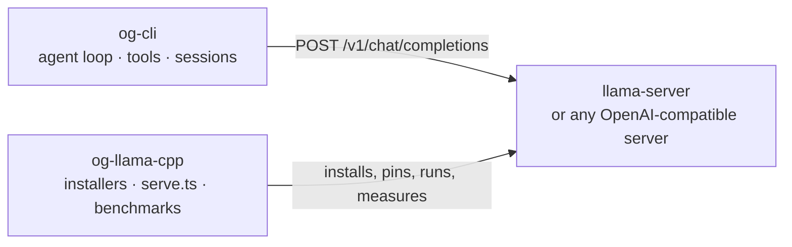

# og-ai

A coding agent and a GPU inference server, kept as two projects in one repository because they are
two concerns. The agent speaks OpenAI-compatible HTTP to whatever endpoint you point it at; the
server project is one good way to put such an endpoint on your own machine. Use them together and
inference, code and conversation history never leave the box.

```
og-ai/
  README.md       this file
  AGENTS.md       the single agent-facing context file for both projects
  og-cli/         the coding CLI — agent loop, tools, sessions, TUI + headless
  og-llama-cpp/   the inference server — pinned llama.cpp CUDA build, installers, launcher, benchmarks
```

| Project | What it gives you | Start at |
| --- | --- | --- |
| [`og-cli/`](og-cli/) | `og` on your `PATH`: an agent loop, seven sandboxed tools, a SQLite session store, and two front-ends | [`og-cli/README.md`](og-cli/README.md) |
| [`og-llama-cpp/`](og-llama-cpp/) | `llama-server` in `~/.local/llama.cpp/current`, built or unzipped from one pinned llama.cpp tag, plus `serve.ts` to run it and a browser UI to pick the weights that fit | [`og-llama-cpp/README.md`](og-llama-cpp/README.md) |

## Why two projects



The boundary is HTTP and nothing else. `og-cli` is a **client**: it sends chat completions to
whatever `endpoint` names and streams the reply. It never starts, adopts, restarts or stops a
server, and it has no notion of weights, VRAM or offload — substitute vLLM, OpenAI, OpenRouter or a
gateway for the `llama-server` box above and nothing in the CLI changes. `og-llama-cpp` owns the
other side entirely: installing a pinned llama.cpp CUDA build, building its argv, running it,
measuring it. It does not know `og` exists.

Either project is useful alone. Point `og` at a hosted API and you never need `og-llama-cpp`, a
GPU, or a local server of any kind. Use the installers and `serve.ts` to get a measured,
tuned `llama-server` and drive it with anything you like.

One git repository, [`hjawhar/og-ai`](https://github.com/hjawhar/og-ai), holding two projects.
There is no workspace-level build, lockfile or package — every command runs inside one
subdirectory or the other, and neither project's source ever reaches across the boundary.

## The problem this exists to solve

The hosted-UI runner previously used on the reference machine (LM Studio) mis-sized a 30B MoE
model for a 16 GiB card. It loaded, it answered, and it did so about **eight times slower than
the hardware allows**: once resident VRAM crosses roughly 15.4 GiB the NVIDIA driver silently
pages weights back into host RAM over PCIe. Nothing in that stack surfaced the spill — no error,
no warning, just a model that felt sluggish.

That is why the serving side of this repository ships *measured* operating points rather than
sliders: each one is a real run on the reference box, sized to leave VRAM headroom that a browser
opening cannot eat. The measurements, the spill-cliff analysis and the fix ladder all live with the
GPU, in [`og-llama-cpp/docs/benchmarks.md`](og-llama-cpp/docs/benchmarks.md) §5. `og-cli` inherits
exactly one number from that record — the context window it budgets against — and diagnoses nothing
about the GPU, because a client cannot see one.

## Quickstart

Reference box: RTX 5070 Ti (16303 MiB), Ubuntu 26.04, CUDA 13.3, llama.cpp b10488.

```sh
git clone https://github.com/hjawhar/og-ai && cd og-ai

# 1. cli — built from source, then copied onto PATH
cd og-cli && bun install && bun run build
install -m755 dist/og ~/.local/bin/og
```

If `endpoint` is going to be a hosted API, you are done — set it and a key, and skip the rest:

```sh
OPENAI_API_KEY=sk-... og -m gpt-4o --endpoint https://api.openai.com --context-window 128000 \
  -p "review this diff"
```

For a local GPU server, install it and one set of weights:

```sh
# 2. server — compiles the pinned tag on Linux, unzips the upstream CUDA release on Windows
cd ../og-llama-cpp && ./install-engine.sh
~/.local/llama.cpp/current/llama-server --list-devices   # must name a CUDA device

# 3. weights — one GGUF in ~/models for the default operating point
mkdir -p ~/models && curl -SfL --retry 5 -C - -o \
  ~/models/Qwen3-Coder-30B-A3B-Instruct-UD-Q4_K_XL.gguf \
  https://huggingface.co/unsloth/Qwen3-Coder-30B-A3B-Instruct-GGUF/resolve/main/Qwen3-Coder-30B-A3B-Instruct-UD-Q4_K_XL.gguf
```

Picking weights in a browser instead: `bun run ui` in `og-llama-cpp/` is the front door on
`http://127.0.0.1:8130` — what is installed, what can be downloaded, what actually fits this card —
and it launches the chosen model for you.

Then **two terminals**. The server runs in the foreground; Ctrl-C there frees the card:

```sh
# terminal 1 — the server. --list shows the operating points, --dry-run prints the argv only
cd og-ai/og-llama-cpp && bun run serve.ts
# ... llama-server logs, ending with: listening on http://127.0.0.1:8127
```

```sh
# terminal 2 — the client
og models          # what is configured, and where each model's requests go. Needs no server
og                 # interactive TUI
```

`og` probes the endpoint once before a run and refuses immediately if nothing answers:

```
error no server answering at http://127.0.0.1:8127 (Unable to connect. Is the computer able to
access the url?). Start one and retry — the og-llama-cpp project's `bun run serve.ts` runs a
local llama.cpp server — or point og elsewhere with --endpoint.
```

Bun >= 1.3 is a **build-time** requirement only: `bun build --compile` emits a self-contained
`dist/og` that embeds its runtime. Nothing is published to a registry — no npm package, no
release pipeline, no CI. Each project's README documents the full path, including the Windows
recipes and the rootless CUDA toolkit setup.

## Where things are documented

| Question | Document |
| --- | --- |
| How do I install, configure and use `og`? | [`og-cli/README.md`](og-cli/README.md) |
| `og` is failing, or answering badly | [`og-cli/docs/runbook.md`](og-cli/docs/runbook.md) |
| How do I get `llama-server` on this box, and run it? | [`og-llama-cpp/README.md`](og-llama-cpp/README.md) |
| How fast is it, why is that the default, and why is my GPU spilling? | [`og-llama-cpp/docs/benchmarks.md`](og-llama-cpp/docs/benchmarks.md) |
| A new llama.cpp build is out | [`og-llama-cpp/docs/upgrading.md`](og-llama-cpp/docs/upgrading.md) |
| I need a patched or differently-configured build | [`og-llama-cpp/docs/building-by-hand.md`](og-llama-cpp/docs/building-by-hand.md) |
| I am an agent working in this tree | [`AGENTS.md`](AGENTS.md) — the only one, covering both projects |

## License

MIT, both projects — see [`og-cli/LICENSE`](og-cli/LICENSE) and
[`og-llama-cpp/LICENSE`](og-llama-cpp/LICENSE). The pinned llama.cpp is MIT too, but it is built
separately and never vendored into either tree.
