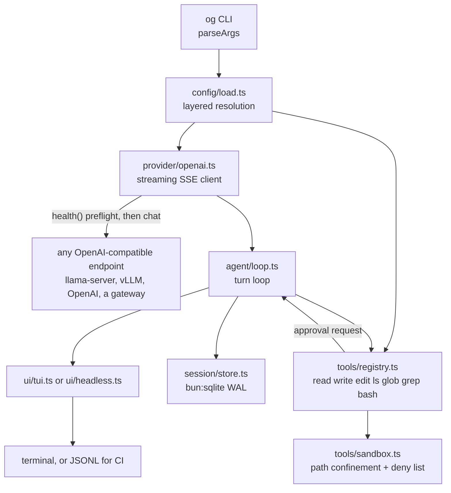

# og

`og` is an agentic coding CLI: an agent loop, a tool suite, a session store and two front-ends
(TUI and headless) wrapped around **any** OpenAI-compatible chat-completions endpoint. It is a
client and nothing more. It opens exactly one kind of network connection — to the `endpoint` you
configure — and it never starts, adopts, supervises or stops an inference server. What runs the
model is somebody else's job.

Local-first is the default rather than a requirement. `endpoint` ships as
`http://127.0.0.1:8127`, so inference, code and conversation history stay on the machine unless
you deliberately aim them elsewhere; a hosted API is one flag away.

One of the two projects in the [`og-ai`](../README.md) repository. This directory is the CLI; the
sibling [`og-llama-cpp`](../og-llama-cpp) installs, runs and measures a pinned llama.cpp CUDA
`llama-server` for the local case, and does not know `og` exists. Neither tree imports from the
other — the boundary is HTTP. Agent-facing context for both lives in one place,
[`../AGENTS.md`](../AGENTS.md).

---

## Requirements

| Component | Requirement |
| --- | --- |
| Build runtime | Bun >= 1.3. `bun build --compile` emits one self-contained binary that needs neither Bun nor Node to run. There are zero runtime dependencies |
| OS | Linux, Windows and macOS all build and run; nothing in the CLI is platform-specific beyond path handling. The reference box is Ubuntu 26.04 (kernel 7.0); the same machine ran Windows 11 Pro build 26200 before that, which is where the server-side figures quoted below were measured |
| An endpoint | Anything answering OpenAI-compatible `POST /v1/chat/completions` with `stream: true` and returning native `tool_calls`. `llama-server`, vLLM, OpenAI, OpenRouter and the usual gateways all qualify |
| A server-side chat template | Tool calling depends on the **server** applying the model's chat template. For llama.cpp that means `--jinja`, which `og-llama-cpp/serve.ts` always passes. Without it tool calls arrive as prose and everything downstream is garbage |
| A GPU | Only if you choose to serve locally — and then it is `og-llama-cpp`'s requirement, not `og`'s. See [`../og-llama-cpp/README.md`](../og-llama-cpp/README.md) |

`og` contains no GPU code, no CUDA assumption, no process supervision and no knowledge of model
weights. It is a Bun program that speaks HTTP and edits files.

## Install

Two separable concerns, deliberately kept in **separate directories that never import from each
other**:

| Concern | Lives in | What it gives you |
| --- | --- | --- |
| The coding CLI | this directory | `og` itself: the agent loop, tools, sessions and both front-ends |
| An inference server (optional) | the sibling [`../og-llama-cpp`](../og-llama-cpp) | a pinned llama.cpp CUDA `llama-server` in `~/.local/llama.cpp/current`, plus `serve.ts` to run it — nothing in it knows about `og` |

One clone gives you both:

```
og-ai/
  README.md       what the two projects are, and why they are two
  AGENTS.md       the single agent-facing context file for both
  og-cli/         this directory
  og-llama-cpp/   installers, the server launcher, benchmarks, the pinned llama.cpp build
```

### 1. `og`

`og` is built, not installed from a registry — it runs on Bun APIs (`bun:sqlite`, `Bun.spawn`,
`Bun.Glob`) and is distributed as source:

```sh
git clone https://github.com/hjawhar/og-ai && cd og-ai/og-cli
bun install                  # dev dependencies: typescript + @types/bun, nothing else
bun run build                # -> dist/og, one self-contained executable (dist/og.exe on Windows)
install -m755 dist/og ~/.local/bin/og        # or anywhere on PATH
```

`bun install` is a **build-time** requirement only. The compiled `dist/og` embeds its runtime and
needs neither Bun nor Node on the machine that runs it, so building once and copying the binary to
another box of the same platform works. Cross-compile with `bun build --compile --target
bun-<platform>-<arch>` if you want a binary for a machine you are not on.

Or skip the binary entirely and run from source — `bun run src/index.ts <args>` is equivalent to
`og <args>` everywhere in this document.

### 2. An endpoint

Pick one. All three are first-class; worked configs for each are under
[Worked backend configs](#worked-backend-configs).

| Backend | Bring it up | Then |
| --- | --- | --- |
| Local `llama-server` | `cd ../og-llama-cpp && bun run serve.ts` | nothing — the shipped default `endpoint` already points at it |
| A hosted OpenAI-compatible API | nothing to install | set `endpoint` and `apiKeyEnv` |
| A server already running elsewhere | somebody else's terminal | `og --endpoint http://gpubox.lan:8127` |

For the local case, installing the pinned llama.cpp CUDA build — prerequisites, env knobs, the
upgrade and rollback drill — lives entirely in
[`../og-llama-cpp/README.md`](../og-llama-cpp/README.md) and
[`../og-llama-cpp/docs/upgrading.md`](../og-llama-cpp/docs/upgrading.md). `og` plays no part in it.

`serve.ts` runs in the **foreground**: it is a server in a terminal, and Ctrl-C there stops
it and frees the card. `og` in a second terminal is a client of that server like any other. There
is no autostart, no adopt, no pid file and no way for `og` to restart anything — if the endpoint
is down, `og` says so and stops.

### 3. First run

```console
$ og models
* qwen3-coder-30b        qwen3-coder-30b @ http://127.0.0.1:8127
  window 32768 · top-p 0.8 · top-k 20 · min-p 0 · repeat-penalty 1.05
  qwen3-coder-30b-long   qwen3-coder-30b-long @ http://127.0.0.1:8127
  window 65536 · top-p 0.8 · top-k 20 · min-p 0 · repeat-penalty 1.05
  qwen3-coder-30b-fast   qwen3-coder-30b-fast @ http://127.0.0.1:8127
  window 32768 · top-p 0.8 · top-k 20 · min-p 0 · repeat-penalty 1.05
  devstral-24b           devstral-24b @ http://127.0.0.1:8127
  window 8192 · top-p 0.95
og models use <key> sets the default; -m <name> accepts any model the endpoint serves

$ og -p "reply with the single word ready" --max-steps 1
ready
```

`og models` is pure config resolution — it opens no socket and needs nothing listening, so it
answers "is my config what I think it is, and where would this model's requests go?". The second
command is the first thing that needs a server: `og` runs one health probe against `endpoint`
before the run and fails fast if nothing answers.

```console
$ og -p "hello"
error no server answering at http://127.0.0.1:8127 (Unable to connect. Is the computer able to
access the url?). Start one and retry — the og-llama-cpp project's `bun run serve.ts` runs a
local llama.cpp server — or point og elsewhere with --endpoint.
```

### Developing

```sh
bun run src/index.ts models     # run straight from source
bun x tsc --noEmit              # typecheck
bun test                        # full suite
```

There is no CI. Nothing is published and no workflow runs on push, so those three commands plus
`bun run build` are the entire pre-merge contract — run them locally. Tests are deterministic and
isolated: temp dirs under `os.tmpdir()`, no real inference server, no `~/.og`, no network beyond a
test-owned `Bun.serve` on port 0.

Everything below is written as `og ...`; from a source checkout the equivalent is
`bun run src/index.ts ...`.

## Usage

```sh
og                                      # interactive TUI
og "add a peek() method to src/lru.ts"  # one-shot in the TUI renderer
og -p "fix the failing test in src/fizz.ts"    # headless: answer on stdout, diagnostics on stderr
git diff | og -p "review this"          # piped stdin becomes the prompt
og --json -p "reply with the single word ready"  # JSONL events for CI
og -c -p "now add tests for it"         # continue the latest session for this directory
og -r 7d8ba2ec-635d-4f9e-bd1e-ca0ebe7fd9fd     # resume a specific session
og -m qwen3-coder-30b-fast -p "explain src/agent/loop.ts"
og -m gpt-4o --endpoint https://api.openai.com --context-window 128000 -p "..."
og --endpoint http://gpubox.lan:8127 -p "review this diff"
og models                               # also: models use <key>
og sessions list                        # also: sessions show <id>, sessions rm <id>
```

`og --help` is the authoritative flag list. Full surface:
`-p/--print`, `--json`, `-m/--model <name>`, `-c/--continue`, `-r/--resume <id>`, `--cwd <dir>`,
`--endpoint <url>`, `--context-window <n>`, `--max-steps <n>`, `-v/--verbose`, `--version`,
`-h/--help`.

`-m` accepts **any** model name, registered or not: an unknown name is synthesised into a
single-entry model spec, so `og -m <whatever> --endpoint <url>` works with no config file at all.
See [Pass-through models](#pass-through-models).

Inside the TUI: `/help`, `/models [list|switch <key>|info <key>]`, `/model`, `/usage`, `/stats`,
`/context`, `/clear`, `/sessions`, `/resume <id>`, `/cost`, `/exit`. `Ctrl+C` aborts a run in
flight, twice quits; `Ctrl+D` quits. `Tab` completes commands, model keys and paths.

### The pinned status row

The top line of the terminal is **reserved**, not reprinted. `og` installs a DECSTBM scroll
region covering rows 2..N, so the transcript scrolls underneath a row that never moves. There
is exactly one place on screen where context occupancy lives.

Idle, then running:

```
qwen3-coder-30b · ~/Workspace/og-ai/og-cli · 127.0.0.1:8199 · ctx █░░░░░░░░░ 6% 2.1k/32.8k · 0 tok
⠸ qwen3-coder-30b · generating · 4.2s · 82.1 tok/s · ttft 380ms · ctx ██░░░░░░░░ 16% 5.2k/32.8k
```

| Field | Meaning |
| --- | --- |
| model | active model key, and the head of the idle row (`/models switch` changes it) |
| spinner (running) | the run is alive; it disappears the moment the run settles, and the model name becomes the head again |
| path (idle) | cwd, elided from the left |
| endpoint (idle) | dim `host[:port]` of where this session's requests go — no scheme, no path, so `https://openrouter.ai/api/v1` reads `openrouter.ai`. An endpoint `new URL()` cannot parse is printed verbatim |
| phase | `reading context` while the server prefills, `generating` while tokens stream, or `<tool> <elapsed>` while a tool runs (`+N` when several run in parallel) |
| elapsed | wall clock for the request |
| tok/s | **decode-only** throughput; prefill and tool waits are excluded, and samples under 250 ms are withheld instead of reported as a spike |
| ttft | time to first token for this run, once it arrives |
| `ctx` gauge | bar, percentage and absolute `used/window` tokens. Green under 60%, yellow from 60%, red from 85%; compaction fires at `agent.compactThresholdPct` (default 75%) |
| tokens (idle) | cumulative session tokens |
| right-aligned text (idle) | session title, from the first prompt, when there is room |

The row carries no reachability indicator and no VRAM figure, and both omissions are deliberate:
it repaints every 120 ms, so a liveness light there would mean an HTTP probe per keystroke, and a
client cannot see the GPU at all. Endpoint liveness is established once, by the preflight before a
run; what is resident on that GPU is diagnosed where the GPU is, in
[`../og-llama-cpp`](../og-llama-cpp).

The row sheds segments as the terminal narrows — the endpoint first, then the token total, and
finally the gauge itself compacts:

```
qwen3-coder-30b · ~/Workspace/og-ai/og-cli · ctx ██░░░░░░░░ 16% 5.2k/32.8k · 12.4k tok
qwen3-coder-30b · ~/Workspace/og-ai/og-cli · ctx ██░░░░░░░░ 16% 5.2k/32.8k
qwen3-coder-30b · ctx 16%/32.8k ── add peek() t…
```

It reflows on resize, gives itself back if the terminal shrinks below six rows, emits nothing when
stdout is not a TTY, and releases the scroll region on every exit path including
`uncaughtException` — a process that dies with a region installed would leave your shell
scrolling inside a sub-window. Set `OG_ASCII=1` to draw gauges with `=`/`.`.

Run summaries stay in the transcript and deliberately carry no context gauge, so occupancy is
never shown in two places:

```
2 steps · 1.5s · 82.1 tok/s gen · ttft 1.2s
```

### `/usage` — occupancy, throughput and TTFT

`/usage` opens with a `model` block naming the active key, its wire id, its effective endpoint, its
context window and whichever sampling knobs are actually set — everything that determines where a
request goes and what it will contain. The remaining blocks are context occupancy, this session's
token totals, the last run, and aggregate decode/TTFT statistics for that model:

```
context
  ctx █░░░░░░░░░ 5% 1.5k/32.8k
  reserve 25% · compaction at 75% (24.6k) · 31.3k free
this session
  1 run · 5116↑ 42↓ = 5.2k tok
  stored total 5.2k tok across 5 messages
last run
  2 steps · 1.5s wall · decode 42 tok in 180ms (sample too short to rate) · ttft 1.2s
across 1 run on this model
  decode 82.1 tok/s over 1.4k generated tokens
  ttft over 1 turn: median 726ms · mean 726ms · min 726ms · max 726ms
  ttft includes prefill of the whole transcript, so it grows with context
```

TTFT is measured per model turn, so a multi-step run contributes one sample per turn. Metrics
are filtered to the active model: switching models does not mix two models' throughput.

### `/stats` — machine and endpoint

```
host
  os         linux 7.0.0-30-generic (x64)
  hostname   tracecall-pc
  uptime     57m40s

cpu
  model      AMD Ryzen 7 9800X3D 8-Core Processor
  cores      8 physical · 16 logical
  clock      5200 MHz

memory
  installed  59.5 GiB
  in use     ██░░░░░░░░ 17% 9.8 GiB
  free       49.7 GiB

runtime
  bun        1.3.14
  node api   24.3.0

endpoint
  url        http://127.0.0.1:8127
  model      qwen3-coder-30b
  context    32768
```

On Windows the same fields render with `win32` values — `win32 10.0.26200 (x64)` on the `os` line.

There is no GPU section. `og` does not run `nvidia-smi` and has no way to know whether the machine
it is on is even the machine serving the model. GPU state belongs to whoever runs the server:
`nvidia-smi` there, or the sweep in [`../og-llama-cpp`](../og-llama-cpp).

### Switching models

```sh
og models                    # every configured entry, its wire id and its effective endpoint
og models use <key>          # persist the default to ~/.og/config.json

/models list                 # inside the TUI
/models switch <key>         # change model for this session
/models info <key>           # everything configured for one entry
```

A switch takes effect on the next prompt. If two entries point at the same endpoint and that
server has only one model loaded, switching between them is a request the *server* will reject or
silently reinterpret — `og` sends the wire id it was given and reports what came back. Which
models an endpoint actually serves is the endpoint's business, and `-m` deliberately does not
second-guess it.

### Shell completion

**Bash:**

```sh
# current session
eval "$(og completion bash)"

# permanently
og completion bash > ~/.og-completion.bash
echo 'source ~/.og-completion.bash' >> ~/.bashrc
```

**PowerShell** — the same vocabulary, on a Windows install:

```powershell
og completion powershell | Out-String | Invoke-Expression   # this session
og completion powershell | Out-File -Append $PROFILE        # permanently
```

Completes subcommands (`models`, `sessions`, `completion`), their actions, and all flags. The
vocabulary is static — nothing runs `og` at completion time, so completion works with no server
anywhere in sight. Known PowerShell 5.1 limitation: its parser never invokes native completers
while you are mid-typing a `-flag` word, so flags complete after a positional word but not from a
bare `-`; bash has no such gap.

Headless mode reports usage per turn on stderr:
`tokens 2264↑ 2↓ · context 3% (962/32.8k)`.

### Exit codes

| Code | Meaning |
| --- | --- |
| `0` | success |
| `1` | error: bad config, an endpoint that is unreachable or answering with failures, unknown session, or a run that ended with a fatal agent error |
| `2` | step cap reached (`agent.maxSteps`, or `--max-steps`) |
| `130` | aborted (`Ctrl+C` / SIGINT) |

Precedence when several apply: a real failure outranks an interrupt, which outranks the step cap.

### `--json` for CI

`--json` implies `-p`, sends one JSON object per line to stdout, and ends with exactly one
`result` line — so a CI step can stream progress and still parse a single summary:

```console
$ og --json -p "reply with the single word ready" --max-steps 1
{"type":"turn-start","step":1}
{"type":"text","delta":"ready"}
{"type":"usage","promptTokens":2178,"completionTokens":2,"contextUsedPct":2.5848388671875}
{"type":"done","steps":1,"stopReason":"stop"}
{"type":"result","text":"ready","steps":1,"stopReason":"stop","promptTokens":2178,"completionTokens":2,"sessionId":"d5a1d59d-c6fc-41e2-b0c5-7db7dd9e2033"}
```

Event types: `turn-start`, `text`, `reasoning`, `tool-start`, `tool-end`, `approval`, `usage`,
`compaction`, `error`, `done`, then `result`. `contextUsedPct` is a **percentage** (0-100), not
a fraction. The `approval` event is emitted without its `resolve` closure.

## Configuration

### Layering

Later layers win; objects merge recursively, arrays and scalars replace wholesale:

```
DEFAULT_CONFIG  ->  ~/.og/config.json  ->  <workspace>/.og/config.json  ->  OG_* env  ->  CLI flags
```

`<workspace>` is the nearest ancestor of the working directory containing `.git`, else the
working directory itself. Use `~/.og/config.json` for machine facts (which endpoint you dial,
which model you prefer, which env var holds your key) and `<workspace>/.og/config.json` for
per-repo policy (approval rules, step caps, a repo-specific model). An invalid field fails fast
with a `ConfigError` naming the field — malformed JSON never silently degrades to defaults.

### Top-level fields

| Field | Meaning |
| --- | --- |
| `endpoint` | **Base URL** of the OpenAI-compatible API — `og` appends `/v1/chat/completions` itself, so this is `https://api.openai.com`, not `.../v1`. Trailing slashes are trimmed. Default `http://127.0.0.1:8127` |
| `apiKey` | Bearer token used when the active model does not name its own `apiKeyEnv`. Prefer `OG_API_KEY` or `apiKeyEnv` over writing a key into a file |
| `model` | Active key in `models`; any name at all when given on the command line or in `OG_MODEL` — see [Pass-through models](#pass-through-models). Default `qwen3-coder-30b` |
| `models` | Record of model key -> spec, below |
| `agent` | Turn loop and context budget, below |
| `tools` | Tool enablement, approval and caps, below |
| `stateDir` | Where `config.json`, `sessions.db` and `history` live. Default `~/.og` |

### `models` entries

Every field except `contextWindow` is optional, and an omitted field falls back rather than
guessing:

| Field | Meaning |
| --- | --- |
| `id` | Value sent as the OpenAI `model` field. Defaults to the record key, which is usually what you want |
| `endpoint` | Per-model endpoint override. Falls back to the top-level `endpoint`, so one config can address several backends at once |
| `apiKeyEnv` | Name of the environment variable holding this model's bearer token — `"OPENAI_API_KEY"`, not the key itself. An unset or empty variable is a `ConfigError`, not a silent anonymous request. Falls back to `apiKey` |
| `headers` | Extra request headers merged into every call: OpenRouter attribution, a gateway's tenant header, a tracing id |
| `contextWindow` | **Required.** Usable window in tokens; the agent budgets and compacts against it. This is the one number that has to match what the server will actually serve — see [Model entries and measured numbers](#model-entries-and-measured-numbers) |
| `maxTokens` | Per-model response cap. Falls back to `agent.maxTokens` |
| `temperature` | Sent only when set; otherwise `agent.temperature` (0.2) governs |
| `topP` | Nucleus sampling (`top_p`). A standard OpenAI parameter |
| `topK`, `minP`, `repeatPenalty` | **llama.cpp / vLLM extensions.** Sent as `top_k` / `min_p` / `repeat_penalty`, which OpenAI proper rejects as unknown arguments — leave all three unset for OpenAI and for any gateway that validates strictly |

Each sampling field is sent **only when set**, so an entry with no knobs produces a minimal,
maximally portable request body.

### Pass-through models

A model you name **explicitly** — `-m <name>` or `OG_MODEL` — does not have to be a key of
`models`. An unrecognised one is synthesised into an entry of its own,
`{ id: <name>, contextWindow: 32768 }` (or whatever `--context-window` says), so a one-off needs no
config file:

```sh
OPENAI_API_KEY=sk-... og -m gpt-4o --endpoint https://api.openai.com --context-window 128000 \
  -p "review this diff"
```

The escape hatch is deliberately limited to the command line and the environment. A `model` written
into a **config file** is still validated against `models`, so a typo there fails with
`unknown model "..."; available: ...` instead of silently dialling a model the endpoint does not
have. Any endpoint names its own models, so demanding a config entry first would make `-m` useless
against every endpoint but the configured one — while a config file is something you can proofread.

`--context-window <n>` also overrides the window of a *registered* entry, which is the honest fix
when a server turns out to be serving a different `-c` than your config claims.

### Environment variables

| Variable | Effect |
| --- | --- |
| `OG_ENDPOINT` | override `endpoint` |
| `OG_MODEL` | override the active model |
| `OG_API_KEY` | override `apiKey` — the bearer token for endpoints that do not name an `apiKeyEnv` |
| `OG_STATE_DIR` | override `~/.og` |

`apiKeyEnv` reads any variable you name, so `OPENAI_API_KEY`, `OPENROUTER_API_KEY` and friends
work without `og` knowing they exist.

### Agent and tool fields

`agent`: `maxSteps` (60), `temperature` (0.2), `maxTokens` (8192), `contextReservePct` (0.25 of
the window held back for the next response plus tool results), `compactThresholdPct` (0.75 —
compact once used tokens exceed this fraction of the window), `maxParallelTools` (4).

`tools`: `bash.enabled`, `bash.approval`, `bash.timeoutMs` (120 000), `bash.denyPatterns`,
`edit.approval`, `denyPaths`, `maxOutputBytes` (65 536 bytes returned to the model per call).

### Approval policies

Three values, and which requests each gates:

| Policy | Behaviour without a human (headless) | Behaviour in the TUI |
| --- | --- | --- |
| `never` | auto-approve | auto-approve, no prompt |
| `unsafe-only` | approve everything except `exec`-risk requests | prompt only for `exec`-risk requests |
| `always` | refuse — there is nobody to ask | prompt for every gated request |

Routing is fixed: **read-only** requests (`read`, `ls`, `glob`, `grep`) are never gated;
`bash` and any `exec`-risk request is governed by `tools.bash.approval`; every other mutating
request (`write`, `edit`) is governed by `tools.edit.approval`. `bash.denyPatterns` are
absolute — a matching command is refused regardless of policy, and no approval can override it.

Defaults are `bash: "unsafe-only"`, `edit: "never"`.

### Worked example: auto-approve edits, prompt for shell

`<repo>/.og/config.json`:

```json
{
  "model": "qwen3-coder-30b",
  "agent": { "maxSteps": 40 },
  "tools": {
    "edit": { "approval": "never" },
    "bash": { "approval": "always", "timeoutMs": 300000 },
    "denyPaths": [
      "**/.git/objects/**",
      "**/node_modules/**",
      "**/.env",
      "**/.env.*",
      "**/*.pem",
      "**/*.key",
      "**/id_rsa*",
      "**/.ssh/**",
      "**/.og/sessions.db*",
      "infra/terraform/**"
    ]
  }
}
```

The agent rewrites source freely (git is the undo button) but every command — including
`bun test` — waits for a keypress. Note that `denyPaths` is an **array**, so this replaces the
default list rather than extending it; the defaults are repeated above before the new entry.
In headless CI this config would deny all `bash` calls, so CI should ship its own overlay with
`"bash": { "approval": "unsafe-only" }`.

### Worked backend configs

**A. A local `llama-server`, started by `og-llama-cpp`.** This is the shipped default, so the file
below is only needed if you change a port or want a narrower window than the measured one. Bring
the server up first and leave it in the foreground:

```sh
cd ../og-llama-cpp && bun run serve.ts --profile qwen3-coder-30b
```

```json
{
  "endpoint": "http://127.0.0.1:8127",
  "model": "qwen3-coder-30b",
  "models": {
    "qwen3-coder-30b": {
      "contextWindow": 32768,
      "topP": 0.8,
      "topK": 20,
      "minP": 0,
      "repeatPenalty": 1.05
    }
  }
}
```

No key is needed: `llama-server` on loopback is unauthenticated. `contextWindow` must be `<=` the
`-c` the server was started with — `serve.ts --profile qwen3-coder-30b` uses 32768, which is
where this number comes from.

**B. OpenAI proper.** The key lives in the environment, never in the file. `topK`, `minP` and
`repeatPenalty` are deliberately absent: OpenAI rejects unknown arguments, so an entry that sets
them fails every request.

```json
{
  "endpoint": "https://api.openai.com",
  "model": "gpt-4o",
  "models": {
    "gpt-4o": {
      "apiKeyEnv": "OPENAI_API_KEY",
      "contextWindow": 128000,
      "maxTokens": 16384,
      "temperature": 0.2
    }
  }
}
```

**C. An OpenAI-compatible gateway, with a per-model endpoint and headers.** The top-level
`endpoint` is the fallback; entries that name their own `endpoint` win, so one config addresses a
local server and a remote gateway simultaneously and `/models switch` moves between them
mid-session.

```json
{
  "endpoint": "http://127.0.0.1:8127",
  "model": "qwen3-coder-30b",
  "models": {
    "qwen3-coder-30b": { "contextWindow": 32768, "topP": 0.8, "topK": 20, "minP": 0, "repeatPenalty": 1.05 },
    "sonnet": {
      "id": "anthropic/claude-sonnet-4",
      "endpoint": "https://openrouter.ai/api",
      "apiKeyEnv": "OPENROUTER_API_KEY",
      "headers": {
        "HTTP-Referer": "https://github.com/hjawhar/og-ai",
        "X-Title": "og"
      },
      "contextWindow": 200000,
      "maxTokens": 8192
    }
  }
}
```

`id` is what goes on the wire; the record key is only the name you type. That indirection is why
`sonnet` can stay short while the gateway gets the fully qualified slug it requires. Note that the
local entry keeps its llama.cpp sampling extensions and the gateway entry does not — per-entry
sampling is exactly why those knobs live on the model rather than at the top level.

## Model entries and measured numbers

`og` ships four entries, and the only server-side number it carries for each is `contextWindow`:

| Entry | `contextWindow` | Sampling |
| --- | --- | --- |
| `qwen3-coder-30b` *(default)* | 32768 | `top-p 0.8 · top-k 20 · min-p 0 · repeat-penalty 1.05` |
| `qwen3-coder-30b-long` | 65536 | same |
| `qwen3-coder-30b-fast` | 32768 | same |
| `devstral-24b` | 8192 | `top-p 0.95` |

`agent.temperature` (0.2) governs all four; none sets its own. The Qwen knobs are the model
author's recommended values, and because `topK`/`minP`/`repeatPenalty` are llama.cpp/vLLM
extensions, these three entries only work against that kind of server.

Those windows are not arbitrary, and they are not something `og` configures. Each is a window the
reference server was **measured** delivering at safe VRAM headroom on a 16303 MiB RTX 5070 Ti
running llama.cpp b10488 — and the offload split that makes it possible now lives in
`og-llama-cpp/serve.ts`, not here:

| Served as | Weights the server loads | ctx | VRAM (MiB) | Prefill (tok/s) | Generation (tok/s) | Pick when |
| --- | --- | --- | --- | --- | --- | --- |
| `qwen3-coder-30b` | `Qwen3-Coder-30B-A3B-Instruct-UD-Q4_K_XL.gguf` (16.45 GiB) | 32768 | 14714 | 1476 | 82.1 | Default. Best quality-per-token that still leaves ~1.6 GiB of headroom |
| `qwen3-coder-30b-long` | same Q4_K_XL | 65536 | 15082 | 1238 | 69.5 | Large refactors and long transcripts; costs ~15% throughput for 2x context |
| `qwen3-coder-30b-fast` | `Qwen3-Coder-30B-A3B-Instruct-UD-Q3_K_XL.gguf` (12.86 GiB) | 32768 | 14569 | 2957 | 136.5 | Iteration speed over precision: ~1.7x generation, 2x prefill, at Q3 quality |
| `devstral-24b` | `Devstral-Small-2507-Q4_K_M.gguf` (13.35 GiB) | 8192 | 15045 | 2292 | 51.3 | Second opinion from a dense model. 8k window is the hard ceiling on 16 GiB |

Read that table as **what the referenced server delivers**, not as anything `og` sets. Measured
under Windows 11 with a 6k-token prefill and a 256-token generation, `q8_0` KV, flash attention
on, VRAM sampled with `nvidia-smi` while loaded; idle desktop use was 968 MiB of the 16303 MiB
card, so the working budget is ~15200 MiB. Dense 24B at Q4 leaves room for only 8k of KV once
fully offloaded — buying 32k by partial offload measured 14.1 tok/s generation, a 3.6x loss — so
full offload with a short window is the only sane operating point for `devstral-24b`.

A `llama-bench` spot-check after the box moved to Ubuntu 26.04 (CUDA 13.3 toolkit, driver 595.84,
same b10488 source tag compiled locally) reported **1611 tok/s prefill and 102 tok/s generation**
on the default operating point (`-ngl 99 -ncmoe 14 -ctk q8_0 -ctv q8_0 -fa 1 -p 6144 -n 256 -r 1`),
so Linux is no slower there than the Windows sweep. That spot-check is not part of the sweep
record, and the other three rows have not been re-run under Linux at all.

The reason any of this is measured rather than guessed: on this card, resident VRAM past roughly
15.4 GiB makes the driver page weights to host RAM, and throughput drops about 8x with no error
and no log line anywhere. That failure and its fix ladder belong to whoever runs the server, and
are documented where the GPU is —
[`../og-llama-cpp/docs/benchmarks.md`](../og-llama-cpp/docs/benchmarks.md) has the full sweep and
the spill analysis. Client-side operations and failure modes: [`docs/runbook.md`](docs/runbook.md).

## Architecture

| Module | Responsibility |
| --- | --- |
| `src/config/` | Layered config resolution and validation; owns `DEFAULT_CONFIG`, `loadConfig` and `modelSpecOf` |
| `src/provider/` | The only code here that opens a socket: OpenAI-compatible streaming client — SSE parsing, indexed tool-call accumulation, endpoint health probing, retry classification |
| `src/tools/` | The seven tools (`read`, `write`, `edit`, `ls`, `glob`, `grep`, `bash`) and the sandbox that confines them |
| `src/agent/` | The turn loop, system prompt, token accounting and history compaction |
| `src/session/` | `bun:sqlite` (WAL) persistence of sessions, messages and usage |
| `src/ui/` | Pure formatters plus the two surfaces: interactive TUI and headless/JSONL |



The only child process `og` ever starts is the one the `bash` tool was asked to run.

### Two invariants that keep tool calling working

1. **The server must apply the model's chat template.** Tool calls have to arrive as native
   OpenAI-style `tool_calls`, not as prose that something downstream scrapes. For llama.cpp that
   is `--jinja`, which `og-llama-cpp/serve.ts` always passes; for a hosted API it is the
   vendor's problem and already true. Without it, tool calling degrades to hallucinated XML — and
   since it is a *server* setting, `og` can only report the symptom, never fix it.
2. **Compaction never separates an assistant tool-call message from its tool replies.**
   History is split into turns (a user message plus every assistant/tool message following it)
   and only whole turns are dropped, oldest first; the newest turn is never dropped. An
   orphaned `role: "tool"` message makes a jinja template fail outright, which looks like a
   provider bug and is not one.

## Remote or shared inference server

`endpoint` is always explicit — there is no baked-in localhost assumption beyond the default
value — so pointing `og` at somebody else's GPU is not a special mode and needs no extra flag:

```sh
og --endpoint http://gpubox.lan:8127 -p "review this diff"
```

An unreachable endpoint fails immediately, before a token is spent, and names what it tried. There
is nothing to disable: `og` was never going to start a server, so a client whose network path is
down simply reports that.

Binding a server to the LAN and giving each client its own slot is configured on the server — in
[`../og-llama-cpp`](../og-llama-cpp) for the llama.cpp case. One consequence reaches back into
this config: `llama-server` divides its KV cache across slots, so `-c 32768 --parallel 4` gives
each client an 8k window. Size `contextWindow` to the **per-slot** figure, not to the server's
total `-c`, or the agent will budget for context the server will not give it.

## Security posture

- **Workspace confinement.** Every model-supplied path is resolved against the workspace root
  with symlinks followed as far as the filesystem allows (walk to the nearest existing
  ancestor, `realpath` it, re-append the tail), so a `link -> /etc` escape is caught. Anything
  outside the root raises `SandboxError`.
- **Deny-listed paths.** `tools.denyPaths` globs are matched against both the absolute and the
  workspace-relative form. Defaults cover `.git/objects`, `node_modules`, `.env*`, `*.pem`,
  `*.key`, `id_rsa*`, `.ssh/**` and `og`'s own `sessions.db` — credentials are unreadable
  even to a compliant agent.
- **Bash deny patterns.** Case-insensitive regexes over the whole command line, refused
  unconditionally and unappealably: drive/profile-root deletes, `mkfs`/`diskpart`/`dd of=`,
  shutdown and `bcdedit`, `HKLM` registry deletes, curl-pipe-to-shell and
  `iwr | iex`, fork bombs, tree-wide `chmod`/`chown`/`takeown`, and `git push --force` to
  `main`/`master`. Scope is deliberately catastrophic-only — ordinary destructive work such as
  `rm -rf build` stays under the approval gate where a human can judge it.
- **Overwrite gating.** `write` to an existing file is refused unless that file was read in
  this session, so the agent cannot blind-clobber a file it never looked at.
- **Approval gating.** See the policy table above. Headless runs never silently escalate: a
  policy that needs a human denies the call and says so on stderr.
- **Output caps.** Tool results are truncated to `tools.maxOutputBytes` on UTF-8 codepoint
  boundaries, so a runaway command cannot blow up the context or the transcript.
- **Keys stay out of config files.** `apiKeyEnv` names an environment variable; `og` reads it at
  request time, prints only the variable's *name* in `og models`, and treats a missing one as a
  hard `ConfigError` rather than sending an anonymous request.
- **One destination, and you choose it.** The only network call `og` makes is to `endpoint`.
  There is no telemetry, no analytics, no update check and no cloud provider baked into the tree.
  With the default loopback endpoint nothing leaves the machine at all; pointing `endpoint` at a
  hosted API is a deliberate decision to send your code and history to that vendor.

## License

MIT — see [`LICENSE`](LICENSE). The pinned llama.cpp used by the local-serving path is MIT too,
but it is built separately (`../og-llama-cpp`) and never vendored into this tree.
